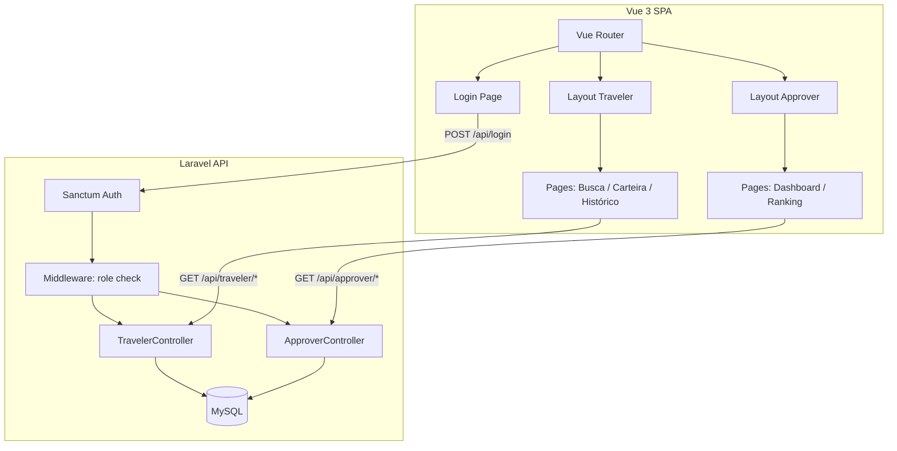

# Scaffolding Design

**Spec**: `.specs/features/scaffolding/spec.md`
**Status**: Draft

---

## Architecture Overview

SPA desacoplada: Vue 3 (frontend) se comunica com Laravel (backend) via API REST JSON. Autenticação via Laravel Sanctum (token SPA). Dois perfis com rotas e layouts distintos.



---

## Tech Decisions

| Decision | Choice | Rationale |
|----------|--------|-----------|
| SPA vs Inertia | SPA pura (Vue Router + API REST) | Permite demonstrar APIs abertas no hackathon; frontend desacoplado |
| Auth | Laravel Sanctum (SPA mode) | Zero config para SPA no mesmo domínio; sem JWT complexo |
| CSS | Tailwind CSS 3 | Prototipação rápida; design tokens via config; ideal para hackathon |
| Componentes | Headless UI + componentes customizados | Acessibilidade built-in; estilização total via Tailwind |
| Build | Vite (default Laravel) | Já vem configurado no Laravel; HMR nativo para Vue |
| Icons | Lucide Vue | Consistente, leve, estilo stroke uniforme |
| Charts | Chart.js + vue-chartjs | Simples, leve, suficiente para dashboard do hackathon |

---

## Design System: Onfly Rewards

### Intent

**Quem é o humano?** Dois perfis:
- **Viajante corporativo** — no escritório ou viajando, busca passagem/hotel antes de uma viagem a trabalho. Quer resolver rápido e, agora, tem incentivo financeiro para escolher bem.
- **Aprovador/Gestor** — CFO ou gestor de viagens, revisa gastos no desktop. Quer ver economia sem esforço.

**O que devem realizar?**
- Viajante: buscar, comparar, escolher a opção com onhappy coins, ver seus créditos
- Aprovador: visualizar economia da equipe, identificar top economizadores

**Como deve sentir?**
- **Confiável como um banco, recompensador como um app de rewards.** Não é gamificação infantil — é sofisticação financeira com um toque de gratificação. Pense Nubank encontra Bloomberg: clean, sério, mas com momentos de "verde positivo" que celebram ganhos.

### Palette

```
Intent: Confiança corporativa + recompensa financeira
```

| Token | Hex | Uso | Por que |
|-------|-----|-----|---------|
| `--brand` | `#0066FF` | Identidade Onfly, links, ações primárias | Azul corporativo — confiança B2B |
| `--brand-light` | `#E8F0FE` | Backgrounds de destaque suave | Suporte ao brand sem competir |
| `--reward` | `#16A34A` | Selos de onhappy coins, saldo positivo, economia | Verde de ganho financeiro — "dinheiro voltando" |
| `--reward-light` | `#DCFCE7` | Background do selo, card de crédito | Celebração sutil sem agressividade |
| `--reward-glow` | `#22C55E` | Animação pulse do selo | Atenção momentânea no selo de economia |
| `--gold` | `#D97706` | Ranking, top economizadores, badges | Dourado de conquista — dividendo merecido |
| `--gold-light` | `#FEF3C7` | Background de destaque em ranking | Suporte ao gold |
| `--surface-0` | `#F8FAFC` | Canvas/background geral | Cinza quase-branco — limpeza financeira |
| `--surface-1` | `#FFFFFF` | Cards, sidebar | Elevação sutil sobre o canvas |
| `--surface-2` | `#F1F5F9` | Inputs, áreas recuadas | Inset — "digite aqui" |
| `--ink` | `#0F172A` | Texto primário | Slate escuro — legibilidade máxima |
| `--ink-secondary` | `#475569` | Texto secundário, labels | Hierarquia sem perder contraste |
| `--ink-muted` | `#94A3B8` | Placeholders, metadata | Informação terciária |
| `--border` | rgba(15,23,42,0.08) | Bordas padrão | Desaparece quando não procura |
| `--border-emphasis` | rgba(15,23,42,0.15) | Bordas de separação forte | Sidebar, divisões de seção |
| `--destructive` | `#DC2626` | Erros, ações destrutivas | Semântica universal de perigo |

### Depth Strategy

**Borders-only + elevation sutil via background shift.** Sem drop shadows dramáticos. Cards usam `--surface-1` sobre `--surface-0` com borda `--border`. Sidebar compartilha `--surface-1` com borda direita `--border-emphasis`.

### Typography

| Level | Font | Size | Weight | Tracking | Por que |
|-------|------|------|--------|----------|---------|
| Display | Inter | 28px | 700 | -0.02em | Números de economia que impressionam no hackathon |
| Heading | Inter | 20px | 600 | -0.01em | Títulos de seção, nomes de página |
| Subheading | Inter | 16px | 600 | 0 | Labels de card, categorias |
| Body | Inter | 14px | 400 | 0 | Texto geral, descrições |
| Caption | Inter | 12px | 500 | 0.01em | Metadata, timestamps, validade |
| Mono/Data | JetBrains Mono | 14px | 500 | 0 | Valores monetários, saldos — tabular nums |

**Por que Inter?** Projetada para telas, excelente em tamanhos pequenos, neutra-profissional sem ser genérica. O peso 600 em headings dá presença sem gritar. JetBrains Mono para dados financeiros garante alinhamento tabular perfeito.

### Spacing

Base unit: **4px**. Scale: 4 / 8 / 12 / 16 / 24 / 32 / 48 / 64.

| Context | Value |
|---------|-------|
| Icon gap | 8px |
| Button padding | 12px 16px |
| Card padding | 20px |
| Card gap | 16px |
| Section gap | 32px |
| Page padding | 24px (mobile) / 32px (desktop) |

### Border Radius

| Element | Radius | Razão |
|---------|--------|-------|
| Buttons | 8px | Profissional, não infantil |
| Cards | 12px | Presença sem ser bolha |
| Inputs | 8px | Consistência com buttons |
| Badges/selos | 8px | Coerência |
| Modals | 16px | Destaque como overlay |
| Avatar | 9999px | Circular — convenção universal |

### Signature Element: Selo de Onhappy Coins

```
┌─────────────────────────────────────────────────┐
│  Hotel Exemplo ★★★★  ·  Curitiba, PR           │
│  R$ 320/noite                                    │
│                                                   │
│  ┌─── ✦ SELO ONHAPPY COINS (pulse animation) ──┐ │
│  │  💰 Escolha esta opção e ganhe              │ │
│  │     120 onhappy coins                        │ │
│  │  ── Economia total: 240 onhappy coins ──    │ │
│  └──────────────────────────────────────────────┘ │
│                                    [Reservar →]   │
└─────────────────────────────────────────────────┘
```

- Background: `--reward-light` com borda `--reward`
- Texto do valor: `--reward` em JetBrains Mono bold
- Animação: `pulse` sutil no ícone (2s ease-in-out infinite), respeitando `prefers-reduced-motion`
- Contraste mínimo: 4.5:1 garantido (verde #16A34A sobre #DCFCE7 = 4.8:1)

---

## Components

### AppShell (Layout Principal)

- **Purpose**: Container SPA com sidebar + header + content area
- **Location**: `src/layouts/AppShell.vue`
- **Interfaces**:
  - `props: { role: 'traveler' | 'approver' }` — controla itens da sidebar
  - `slots: { default }` — conteúdo da página
- **Dependencies**: Vue Router, auth store
- **Behavior**: Sidebar fixa à esquerda (240px desktop), collapsible em mobile (drawer). Header com nome do usuário, empresa, e botão de logout.

### Sidebar

- **Purpose**: Navegação principal contextual por perfil
- **Location**: `src/components/layout/TheSidebar.vue`
- **Behavior**:
  - Viajante: Buscar Viagem, Minha Carteira, Meu Histórico
  - Aprovador: Dashboard de Economia, Ranking de Economia
  - Active state: `--brand` com `--brand-light` background, borda esquerda 3px `--brand`
  - Background: `--surface-1`, mesma cor do canvas para evitar fragmentação visual

### AuthLogin

- **Purpose**: Tela de login simples com seleção implícita de perfil
- **Location**: `src/pages/LoginPage.vue`
- **Behavior**: Email + senha → Sanctum auth → redirect por role

---

## Data Models

### Company

```sql
companies: id, name, cnpj, created_at, updated_at
```

### User

```sql
users: id, company_id(FK), name, email, password, role(enum: traveler|approver),
       department, position, avatar_url, created_at, updated_at
```

### TravelPolicy

```sql
travel_policies: id, company_id(FK), destination_city, destination_state,
                 max_daily_hotel(decimal), max_daily_food(decimal),
                 max_flight(decimal), created_at, updated_at
```

### Wallet

```sql
wallets: id, user_id(FK), balance(decimal), created_at, updated_at
```

### WalletTransaction

```sql
wallet_transactions: id, wallet_id(FK), booking_id(FK nullable),
                     type(enum: credit|debit|expiry), amount(decimal),
                     description, expires_at(date), -- unused: coins don't expire
                     created_at
```

### Booking

```sql
bookings: id, user_id(FK), travel_policy_id(FK),
          modal(enum: hotel|flight|bus|car),
          destination_city, destination_state,
          provider_name, original_price(decimal), paid_price(decimal),
          savings_total(decimal), onhappy_coins_amount(decimal), company_savings(decimal),
          check_in(date), check_out(date), status(enum: confirmed|cancelled),
          created_at, updated_at
```

**Relationships**:
- Company 1:N Users, 1:N TravelPolicies
- User 1:1 Wallet, 1:N Bookings
- Wallet 1:N WalletTransactions
- Booking 1:1 WalletTransaction (o crédito gerado)

---

## Folder Structure

```
onhappy-wallet/
├── app/                          # Laravel backend
│   ├── Http/
│   │   ├── Controllers/Api/
│   │   │   ├── AuthController.php
│   │   │   ├── TravelerController.php
│   │   │   └── ApproverController.php
│   │   └── Middleware/
│   │       └── CheckRole.php
│   ├── Models/
│   │   ├── Company.php
│   │   ├── User.php
│   │   ├── TravelPolicy.php
│   │   ├── Wallet.php
│   │   ├── WalletTransaction.php
│   │   └── Booking.php
│   └── ...
├── database/
│   ├── migrations/
│   └── seeders/
│       ├── DatabaseSeeder.php
│       ├── CompanySeeder.php
│       ├── UserSeeder.php
│       ├── TravelPolicySeeder.php
│       └── WalletSeeder.php
├── resources/
│   └── js/                       # Vue 3 SPA
│       ├── app.js
│       ├── router/
│       │   └── index.js
│       ├── stores/               # Pinia
│       │   └── auth.js
│       ├── layouts/
│       │   └── AppShell.vue
│       ├── components/
│       │   ├── layout/
│       │   │   ├── TheSidebar.vue
│       │   │   └── TheHeader.vue
│       │   └── ui/               # Design system components
│       │       ├── BaseButton.vue
│       │       ├── BaseCard.vue
│       │       ├── BaseBadge.vue
│       │       └── BaseInput.vue
│       └── pages/
│           ├── LoginPage.vue
│           ├── traveler/
│           │   ├── SearchPage.vue
│           │   ├── WalletPage.vue
│           │   └── HistoryPage.vue
│           └── approver/
│               ├── DashboardPage.vue
│               └── RankingPage.vue
├── routes/
│   └── api.php
├── tailwind.config.js            # Design tokens
├── vite.config.js
└── package.json
```

---

## Tailwind Config (Design Tokens)

```javascript
// tailwind.config.js — tokens do design system
module.exports = {
  content: ['./resources/js/**/*.{vue,js}'],
  theme: {
    extend: {
      colors: {
        brand: { DEFAULT: '#0066FF', light: '#E8F0FE' },
        reward: { DEFAULT: '#16A34A', light: '#DCFCE7', glow: '#22C55E' },
        gold: { DEFAULT: '#D97706', light: '#FEF3C7' },
        surface: { 0: '#F8FAFC', 1: '#FFFFFF', 2: '#F1F5F9' },
        ink: { DEFAULT: '#0F172A', secondary: '#475569', muted: '#94A3B8' },
        destructive: '#DC2626',
      },
      fontFamily: {
        sans: ['Inter', 'system-ui', 'sans-serif'],
        mono: ['JetBrains Mono', 'monospace'],
      },
      borderRadius: {
        btn: '8px',
        card: '12px',
        modal: '16px',
      },
      animation: {
        'pulse-slow': 'pulse 2s ease-in-out infinite',
      },
    },
  },
}
```

---

## Error Handling Strategy

| Error Scenario | Handling | User Impact |
|----------------|----------|-------------|
| Login inválido | 422 + mensagem | "Email ou senha incorretos" abaixo do form |
| Token expirado | 401 → redirect login | Redirect automático com toast "Sessão expirada" |
| Rota não autorizada (role) | 403 → redirect home | Redirect para área correta do perfil |
| Página não encontrada | 404 | Página 404 estilizada com link "Voltar ao início" |

---

## Requirement Mapping

| Requirement | Design Component |
|-------------|-----------------|
| SCAF-01 (Setup) | Folder structure + Vite + Tailwind config |
| SCAF-02 (Auth + Perfis) | AuthLogin + AppShell + Sidebar + CheckRole middleware |
| SCAF-03 (Schema DB) | Data Models + Seeders |
| SCAF-04 (Layout + Nav) | AppShell + Sidebar + TheHeader + Vue Router |
| SCAF-05 (Seeds realistas) | Seeders com dados brasileiros |
